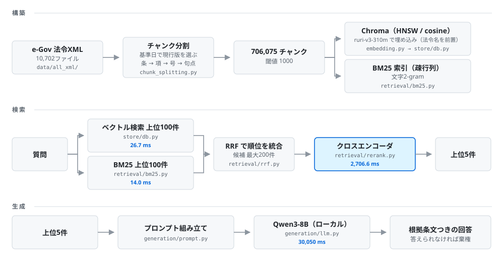

# Legal Link

**あなたと法律をつなぐ。**

**e-Gov の法令XML 全件（8,997法令 / 90万チャンク）を対象に、ローカル完結のRAGで
「根拠条文つきの回答」と「答えられないときの棄権」を検証したプロジェクト。**

検索の評価は、全件から作った**6.5万チャンクのサブセット**で行っている
（理由は[規模](#規模)の節）。

設計上の判断は **ADR** に記録している。却下した選択肢、その理由、
そして**残っている欠点**を各ADRに書いた。

生成モデルの選定で測ったものは、別の資料にまとめている。

| 資料 | 測ったこと |
|---|---|
| [Qwen3-8B 生成パラメータ ベンチマーク](docs/reports/qwen3-8b-generation-parameters.pdf)（PDF） | 生成パラメータだけを変えた193設定で、TTFT・1トークンあたりの時間・レイテンシ・出力トークン数・メモリを測った |
| [Gemini 4 Argon 思考レベル別ベンチマーク](docs/reports/gemini-4-argon-thinking-levels.pdf)（PDF） | 同じ質問を思考レベル3段階 × 各3回 API から実行し、回答が始まるまでの時間・レイテンシ・トークン数・費用・正答を測った |

## デモ


質問を送ると「検索中...」「条文を読み込み中...」と表示が変わり、
そこから回答が少しずつ出てくる。
引いているのは評価用の6.5万チャンクで、全件（90万）ではない。

---

## 何を解決しようとしたか

DV被害者向けの相談チャットAIを、チームのポートフォリオとして開発した
（担当はバックエンド）。そこで法律の知識を持たせた RAG を検討したとき、
**法律はもともと人を守るために書かれているのに、それを必要としている人に届いていない**と感じた。

介護事業の立ち上げを考えていた時も、同じ壁に当たった。
リーガルチェックが大きなボトルネックだった。
**どんな法律が関係するのかを事前に知れていれば、心理的にもずっと楽に進められた。**

条文は公開されていて、誰でも読める。読めるのに届かないのは、
**「自分に関係あるのはどれか」を引く手段が無いから**である。
そこだけを解く道具として作った。

```
法令は検索しづらい     条文は読めるが「自分に関係あるか」が分からない
一般のLLMは創作する   実測: 50問すべてで架空または誤った根拠を提示した
データは公開されている e-Gov が全件XMLで配布している。構造がある
企業で使うなら         外部送信は許されない → ローカル完結が要件になる
```

想定ユーザーは、新規事業を立ち上げるにあたって法律が気になっている事業者。
困りごとは「何を調べればいいか分からない」「抜けがないか確信が持てない」。

---

## 評価の設計

評価セットは `evaluation/rag/eval_set.jsonl` に50問。
1問が `question` / `category` / `answerable` / `gold` / `gold_answer` / `note` を持つ。

### 条文型と状況型に分けて集計する

評価セットの45問は、**gold の細かさが2種類ある**ので分けて集計している。
以下は本書での呼び名で、一般的な用語ではない。

| 呼び名 | 問数 | gold の形 | 例 |
|---|---|---|---|
| **条文型** | 40 | 法令 **＋ 条番号** まで指定 | 食品衛生法 第55条 |
| **状況型** | 5 | **法令のみ**（条は問わない） | 介護保険法、建築基準法 |

状況型は「訪問介護の事業所を立ち上げたい。どんな法律が関係するか」のように
**条を特定できない問いのために用意した**（`category` が `situation` の5問）。
正解の粒度が違うので、同じ Recall として足し合わせない。

### 9つのカテゴリで、検索が壊れる場所を分けて測る

| category | 問数 | 何を測るか |
|---|---|---|
| `fact` | 10 | 条文の内容をそのまま問う。基本形 |
| `number` | 5 | 日数・年齢・期間。**混同しやすい数字**を正しく回答できるか |
| `negation` | 5 | ただし書・適用除外。**読み落とすと結論が逆になる** |
| `comparison` | 5 | 2つの制度の違い。複数条文が要る |
| `multi_doc` | 5 | **2箇所を組み合わせないと答えにならない**。同じ条の別の項のこともある |
| `long` | 5 | 長い相談文。**条文に無い情報がノイズとして混ざる** |
| `summary` | 5 | 複数項目をまとめて列挙させる |
| `situation` | 5 | 状況から関係法令を特定。**プロダクト本来の用途** |
| `unanswerable` | 5 | 法令XMLに答えが無い。**棄権を測る** |

gold は6法令（特定商取引法・介護保険法・都市計画法・消防法・建築基準法・
食品衛生法）に分布している。条文型40問のうち9問、状況型5問すべてが
**gold を複数持つ**（合計14問）。

### 評価データを先に凍結した

実装の前に評価セットを作り、以後変更しないと決めた
（[ADR-0036](docs/adr/0036-freeze-eval-data-first.md)）。
**結果を見てから評価データを直すと、スコアは上がるが意味を失う。**

### 指標は Recall@k / MRR / Hit@k の3つ

定義は `evaluation/rag/metrics.py` にある。3つとも問題ごとに値を出し、
問題数で平均したものを報告している。

```
Recall@k   gold のうち、上位k件に入ったものの割合。
           gold が2条あって1条だけ引けたときは 0.5
MRR        上位k件のうち、最初に gold と一致した件の順位の逆数。
           1位なら 1.0、5位なら 0.2、k件の中に1つも無ければ 0
Hit@k      上位k件に gold が1件でも入ったかを 0 か 1 で数える
```

表の `MRR@100` は、上位100件まで見て数えたものである。

`Hit@k` は当初「計算するが報告しない」としていた。問題ごとの `Recall` から
復元できて新しい情報を持たないためである。**ところが MRR と `Recall` が
カテゴリごとに逆を向き、構成を決められなかった。** 復元できるのは問題ごとの
値で、報告する集計値からは逆算できない。これが報告に加えた理由である。

### Recall@1 には型ごとの天井がある

gold が複数ある問題は、1件では満点を取れない。

```
条文型40問   1条31問 × 1.0 ＋ 2条9問 × 0.5          = 35.5 / 40 = 0.8875
状況型5問    2法令4問 × 0.5 ＋ 3法令1問 × 0.3333     = 2.3333 / 5 = 0.4667
```

`Hit@k` は1問を0か1で数えるため、天井はどちらも 1.0 である。

### 偶然当たる確率が、型によって桁違いに違う

```
条文型   gold は特定の条。その条のチャンクを引かないと当たらない
         長い条は複数チャンクに分かれるので的は1件とは限らないが、
         6.5万件の中ではいずれにせよごく一部

状況型   gold は法令まるごと。その法令に属するチャンクを
         1件でも引けば当たる。大きい法令ほど当たりやすい
```

**同じ数字でも、問題の型によって意味が全く違う。**
だから条文型と状況型を足し合わせず、別々に報告している。

---

## 測定結果

**測った表をここにまとめる。そこから何を決めたかは[測定で分かったこと](#測定で分かったこと)にある。**

### RAGを入れる前と後（50問、人手判定）

**この判定での「RAGあり」は、ベクトル検索のみ・法令名の前置なしの構成である**
（`eval_human_20261020.csv`）。BM25・RRF・リランキング・前置は判定後に実装した。

| | 構成 | 条文型 Recall@10 |
|---|---|---:|
| 判定したとき | 前置なし・ベクトルのみ（修正前のコーパス） | 0.7375 |
| 現在 | 前置あり・ハイブリッド＋リランキング・閾値500 | 0.8875 |

本番は5件渡しなので、現在の構成の指標は `Hit@5` 0.950 / `Recall@5` 0.8750 である。

**検索は上がったが、その構成で生成を作り直して判定し直してはいない。**
下の表は、現在より弱い検索での結果である。

| 判定 | RAGなし | RAGあり（ベクトル検索のみ） |
|---|---|---|
| ○ 条番号・内容ともに正しい | 0 | **11** |
| △ 内容は正しいが項番号の誤り等 | 0 | **11** |
| × 実在の条文だが結論か根拠が誤り | 0 | 14 |
| 創作 条文に無い内容を根拠にした | **50** | 10 |
| 棄権 答えられないと述べた | 0 | 4 |

**RAGなしは50問すべてで創作した。** 存在しない「クーリング・オフ制度に関する法律」
や「賃貸借契約法」を根拠として挙げ、介護保険法の「第355条」を引いた。
**同法の本則は第215条までしかない。**

判定基準と全件の記録は [ADR-0046](docs/adr/0046-human-judgment.md) にある。

### 創作は検索の失敗の症状だった

50問を、**正解の条文が検索の上位10件に入ったかどうか**で分けた
（`convert_jsonl_to_csv.py` が `圏外(検索失敗)` と順位を書き分けている）。
不可答5問は gold が無く「届いた／届かなかった」が定義できないので、
この表からは外してある。だから母数が 45 になる。

```
50問 = 検索が届いた 36 + 届かなかった 9 + 不可答 5
                   └──────── 45 ────────┘
```

| | 問数 | 創作率 | ○+△ |
|---|---|---|---|
| 検索が届いた | 36 | **5.6%**（2/36） | 61%（22/36） |
| 検索が届かなかった | 9 | **78%**（7/9） | **0%**（0/9） |
| （不可答） | 5 | 20%（1/5） | 棄権 4/5 |

**創作率が14倍違う。そして検索が届かなかった9問に ○ も △ も1問もない。**

```
検索は必要条件である      届かなければ 0 / 9
検索は十分条件ではない    届いても 22 / 36
```

この2行が、改善の投資先を検索に決めた根拠である。

検索を外したまま生成パラメータだけで創作が止まるかも測った。
クーリング・オフの1問について Qwen3-8B の
temperature / top_p / top_k / repetition_penalty を193通り総当たりしたところ、
回答に到達した177設定のうち、正しい法令名を挙げたものは0件だった
（[Qwen3-8B 生成パラメータ ベンチマーク](docs/reports/qwen3-8b-generation-parameters.pdf)、PDF）。

### 検索の5方式

コレクションは2本で、`ruri-v3-310m_500_20261013_64593_prefixed_v2`（6.5万チャンク）と
`ruri-v3-310m_1000_20261013_50047_prefixed_v2`（5万チャンク）。どちらも
埋め込むテキストに法令名を前置している。各検索100件を取得し、RRFで統合、
クロスエンコーダで並べ替える。`vector-rerank` は候補をベクトル検索だけで
集めたもので、並べ替えの処理は `hybrid-rerank` と同じである。

条文型40問・**閾値500（採用）**

| 方式 | MRR@100 | Recall@1 | Recall@3 | Recall@5 | Recall@10 | Recall@20 | Recall@30 | Recall@50 | Recall@100 |
|---|---:|---:|---:|---:|---:|---:|---:|---:|---:|
| BM25のみ | 0.3219 | 0.2375 | 0.2750 | 0.3250 | 0.4375 | 0.6000 | 0.6250 | 0.6625 | 0.8375 |
| ベクトルのみ | 0.8061 | 0.6750 | 0.7750 | 0.8125 | **0.9250** | **0.9625** | **0.9625** | 0.9625 | 0.9750 |
| ハイブリッド（RRF） | 0.6178 | 0.4000 | 0.6875 | 0.7000 | 0.8750 | 0.9500 | **0.9625** | 0.9625 | 0.9625 |
| ベクトル＋リランキング | 0.8667 | **0.7375** | **0.8625** | **0.8750** | 0.8875 | 0.9500 | 0.9500 | 0.9625 | 0.9750 |
| **ハイブリッド＋リランキング** | **0.8668** | **0.7375** | **0.8625** | **0.8750** | 0.8875 | 0.9500 | 0.9500 | **0.9750** | **0.9875** |

条文型40問・閾値1000

| 方式 | MRR@100 | Recall@1 | Recall@3 | Recall@5 | Recall@10 | Recall@20 | Recall@30 | Recall@50 | Recall@100 |
|---|---:|---:|---:|---:|---:|---:|---:|---:|---:|
| BM25のみ | 0.3069 | 0.2000 | 0.3000 | 0.3250 | 0.4375 | 0.5625 | 0.6250 | 0.6875 | 0.7875 |
| ベクトルのみ | 0.7567 | 0.6000 | 0.7250 | 0.8250 | 0.8625 | 0.9250 | **0.9625** | 0.9625 | **0.9875** |
| ハイブリッド（RRF） | 0.5660 | 0.3750 | 0.6125 | 0.6875 | 0.8125 | 0.8625 | 0.9000 | 0.9625 | 0.9625 |
| **ベクトル＋リランキング** | **0.8452** | **0.7125** | **0.8250** | **0.8750** | **0.8750** | **0.9500** | 0.9500 | **0.9875** | **0.9875** |
| ハイブリッド＋リランキング | 0.8448 | **0.7125** | **0.8250** | **0.8750** | **0.8750** | 0.9375 | **0.9625** | 0.9750 | **0.9875** |

状況型5問・**閾値500（採用）**

| 方式 | MRR@100 | Recall@1 | Recall@3 | Recall@5 | Recall@10 | Recall@20 | Recall@30 | Recall@50 | Recall@100 |
|---|---:|---:|---:|---:|---:|---:|---:|---:|---:|
| BM25のみ | 0.4976 | 0.2000 | 0.2667 | 0.2667 | 0.2667 | 0.4667 | 0.5667 | 0.5667 | 0.8667 |
| ベクトルのみ | **1.0000** | **0.4667** | **0.4667** | **0.4667** | **0.4667** | 0.5667 | 0.5667 | 0.7333 | 0.7333 |
| ハイブリッド（RRF） | 0.8667 | 0.4000 | **0.4667** | **0.4667** | **0.4667** | 0.4667 | **0.7667** | 0.7667 | 0.8333 |
| ベクトル＋リランキング | 0.8250 | 0.4000 | 0.4000 | 0.4000 | **0.4667** | **0.6667** | 0.6667 | 0.7333 | 0.7333 |
| **ハイブリッド＋リランキング** | 0.9000 | 0.4000 | **0.4667** | **0.4667** | **0.4667** | 0.5667 | **0.7667** | **0.8667** | **0.9333** |

状況型5問・閾値1000

| 方式 | MRR@100 | Recall@1 | Recall@3 | Recall@5 | Recall@10 | Recall@20 | Recall@30 | Recall@50 | Recall@100 |
|---|---:|---:|---:|---:|---:|---:|---:|---:|---:|
| BM25のみ | 0.5105 | 0.2000 | 0.2667 | 0.2667 | 0.3667 | 0.4667 | 0.5667 | **0.7667** | 0.8667 |
| ベクトルのみ | **1.0000** | **0.4667** | **0.4667** | **0.5667** | **0.5667** | 0.5667 | 0.5667 | 0.7333 | 0.7333 |
| ハイブリッド（RRF） | 0.8000 | 0.3000 | **0.4667** | 0.4667 | 0.4667 | 0.5667 | 0.6667 | 0.6667 | **0.9333** |
| ベクトル＋リランキング | 0.8333 | 0.4000 | 0.4000 | 0.4000 | 0.4667 | **0.6667** | 0.6667 | 0.7333 | 0.7333 |
| **ハイブリッド＋リランキング** | 0.8667 | 0.4000 | **0.4667** | 0.4667 | 0.4667 | **0.6667** | **0.7667** | **0.7667** | **0.9333** |

```
条文型   Recall@1〜@5 はどちらの閾値でもリランカーが最良
         閾値500   @10 から @30 で、素のベクトル検索が両方のリランカーを上回る（@10 は 0.9250 対 0.8875）
         閾値1000  両方を同時に上回る k は無い。@30 で hybrid-rerank に並ぶのが最大

状況型   素のベクトル検索が MRR@100 1.0。どちらの閾値でも5問すべてで1位に gold の法令が来ている
         リランカーを通すと @1 が 0.4667 から 0.4000 に落ちる。これも両方の閾値で同じ
         @30 以降は hybrid-rerank が最良か同値
```

**BM25 を除く4方式の `Recall@100` の差は、どちらの閾値でも最大 0.0250（1問分）
である。正解が候補の中にほぼ同じだけ入っていて、違うのは順位だということである。**
リランカーが効くのは、この順位の違いに対してである。閾値1000では `vector` /
`vector-rerank` / `hybrid-rerank` の3方式が 0.9875 で並ぶ。

**カテゴリによってリランカーの効果が逆を向く。** 閾値500の条文型では @1 を
0.6750 から 0.7375 に上げ、状況型では 0.4667 から 0.4000 に下げる。
理由は特定していない。

**最良の方式が入れ替わる k は、閾値によって違う。** 閾値500では @10 から @30 で
素のベクトル検索が両方のリランカーを上回るが、閾値1000ではどの k でも上回らない
（[ADR-0053](docs/adr/0053-search-method-depends-on-k.md)）。

**状況型でベクトルのみの `Recall@1` が 0.4667 なのは、前述の型ごとの天井に
達しているからである。**

閾値500のハイブリッド＋リランキングは `Recall@100` が 0.9875 で、1.0 に 0.0125 足りない。
**0.0125 は、2条 gold の問題で1条しか引けなかったときの差である**（0.5 ÷ 40問）。
1条 gold の問題を1問まるごと落とすと差は 0.0250 になるので、
**不足しているのは2条 gold の問題1つの、2条目1件だと決まる。**
リランカーは並べ替えるだけで、候補に無いものは出せない。

### 5件渡したときの5方式

**上の表は k によって最良の方式が変わる。** 本番で生成に渡すのは5件なので、
k=5 で並べ直して採用を決めた（[ADR-0054](docs/adr/0054-adopt-retrieval-config.md)）。

条文型40問

| 方式 | Hit@5 | MRR@5 | Recall@5 | 検索時間 |
|---|---:|---:|---:|---:|
| BM25のみ | 0.350 | 0.2863 | 0.3250 | 16.9ms |
| ベクトルのみ | 0.850 | 0.7896 | 0.8125 | 17.2ms |
| ハイブリッド（RRF） | 0.775 | 0.5958 | 0.7000 | 35.7ms |
| ベクトル＋リランキング | **0.950** | **0.8646** | **0.8750** | 1,334.9ms |
| **ハイブリッド＋リランキング** | **0.950** | **0.8646** | **0.8750** | 2,138.1ms |

状況型5問

| 方式 | Hit@5 | MRR@5 | Recall@5 |
|---|---:|---:|---:|
| BM25のみ | 0.6 | 0.4667 | 0.2667 |
| ベクトルのみ | **1.0** | **1.0000** | **0.4667** |
| ハイブリッド（RRF） | **1.0** | 0.8667 | **0.4667** |
| ベクトル＋リランキング | 0.8 | 0.8000 | 0.4000 |
| **ハイブリッド＋リランキング** | **1.0** | 0.9000 | **0.4667** |

`Hit@5` は部分点が無いので、問題数にそのまま戻せる。条文型は40問なので
0.950 は38問、0.350 は14問である。
検索時間は条文型の測定で、検索の中央値とリランクの中央値を足したものである
（合計そのものの中央値ではない）。

**状況型では素のベクトル検索が3指標すべてで最良か同値である。** それでも
5件渡しで選ばなかったのは、条文型の `Hit@5` が 0.850（34問）で、リランカー付きの
0.950（38問）より4問少ないからである。**条文型が40問、状況型が5問なので、
条文型を基準にした。**

**これは5件を渡す前提での比較である。** 素のベクトル検索に10件渡した場合との
比較は[測定で分かったこと](#測定で分かったこと)の節で扱う。

条文型では `Hit@5` も `Recall@5` もリランカー付きが上である。
`Recall@5` の差 0.0625 は、`Recall` の最小の刻み 0.0125 の5つ分にあたる。
**`Hit@5` では4問違う。**

### チャンクの分割幅には最適値がある

条を閾値で切る幅を4通り測った。いずれも `hybrid-rerank`、法令名の前置あり、
評価コーパスの法令集合を固定した状態（[ADR-0052](docs/adr/0052-chunk-threshold.md)、
[ADR-0056](docs/adr/0056-adopt-chunk-threshold-500.md)）。

| | 閾値200 | 閾値500 | 閾値1000 | 閾値2000 |
|---|---:|---:|---:|---:|
| 評価サブセットのチャンク数 | 96,487 | 64,593 | 50,047 | 42,387 |
| 現行版全法令のチャンク数 | 1,367,100 | 902,988 | 705,949 | 601,288 |
| チャンクの取得とBM25索引の構築 | 7.1秒 | 5.4秒 | 4.3秒 | 3.8秒 |

最下段は `evaluate_retrieval.py` が出す「チャンクの取得と索引の構築」で、
Chroma から全チャンクを取り出す時間と BM25 索引を作る時間の合計である。
**埋め込みによるコレクションの構築は含まない。** BM25 を使わない
`vector` と `vector-rerank` では、この処理そのものが走らない。
載せているのは `hybrid-rerank` の回だが、**同じコーパスでも実行ごとに動く**
（閾値500で 4.6〜5.4秒、閾値1000で 3.8〜4.3秒。どちらも3回分）。
**閾値1000と閾値2000の差は、この幅に収まっている。**

閾値を上げると条のまま1チャンクになる割合が増え、句点で切った断片は減る。

| 全件のチャンク | 閾値200 | 閾値500 | 閾値1000 | 閾値2000 |
|---|---:|---:|---:|---:|
| `Article`（条のまま1チャンク） | 216,296（15.8%） | 317,345（35.1%） | 358,715（50.8%） | 375,496（62.4%） |
| `Paragraph`（項） | 410,583（30.0%） | 341,617（37.8%） | 245,721（34.8%） | 184,437（30.7%） |
| `Item`（号） | 356,073（26.0%） | 179,310（19.9%） | 85,031（12.0%） | 37,216（6.2%） |
| `Split`（句点で切った断片） | 384,148（28.1%） | 64,716（7.2%） | 16,482（2.3%） | 4,139（0.7%） |

| 評価サブセットのチャンク | 閾値200 | 閾値500 | 閾値1000 | 閾値2000 |
|---|---:|---:|---:|---:|
| `Article` | 15,270（15.8%） | 22,383（34.7%） | 25,351（50.7%） | 26,603（62.8%） |
| `Paragraph` | 28,929（30.0%） | 24,027（37.2%） | 17,193（34.4%） | 12,611（29.8%） |
| `Item` | 27,198（28.2%） | 14,215（22.0%） | 6,565（13.1%） | 2,947（7.0%） |
| `Split` | 25,090（26.0%） | 3,968（6.1%） | 938（1.9%） | 226（0.5%） |

**サブセットの割合は全件とほぼ一致している**。
サブセットは法令IDで選んでいるので、チャンクの構成が全件から
偏っていないことの確認になる。

条文型40問

| 指標 | 閾値200 | 閾値500（採用） | 閾値1000 | 閾値2000 |
|---|---:|---:|---:|---:|
| MRR@100 | 0.8545 | **0.8668** | 0.8448 | 0.8173 |
| Recall@1 | 0.7250 | **0.7375** | 0.7125 | 0.6625 |
| Recall@3 | 0.8250 | **0.8625** | 0.8250 | 0.8250 |
| Recall@5 | 0.8500 | 0.8750 | 0.8750 | **0.8875** |
| Recall@10 | 0.8625 | 0.8875 | 0.8750 | **0.9000** |
| Recall@20 | 0.9125 | **0.9500** | 0.9375 | **0.9500** |
| Recall@30 | 0.9375 | 0.9500 | **0.9625** | 0.9500 |
| Recall@50 | 0.9500 | 0.9750 | 0.9750 | **0.9875** |
| Recall@100 | 0.9625 | 0.9875 | 0.9875 | **1.0000** |


横軸は k を等間隔に並べたもので、k に比例していない。縦軸は 0.60 から始めている。
4本は線の種類でも分けている（実線が採用した閾値500）。
**左端（@1）では閾値500が最も高い。** @5 と @10 では閾値2000が最も高く、
右端では4本が 0.9625 から 1.0000 に収まる。

状況型5問

| 指標 | 閾値200 | 閾値500（採用） | 閾値1000 | 閾値2000 |
|---|---:|---:|---:|---:|
| MRR@100 | **0.9000** | **0.9000** | 0.8667 | 0.7667 |
| Recall@1 | **0.4000** | **0.4000** | **0.4000** | 0.3000 |
| Recall@3 | **0.4667** | **0.4667** | **0.4667** | **0.4667** |
| Recall@5 | **0.4667** | **0.4667** | **0.4667** | **0.4667** |
| Recall@10 | 0.4667 | 0.4667 | 0.4667 | **0.5667** |
| Recall@20 | 0.4667 | 0.5667 | **0.6667** | **0.6667** |
| Recall@30 | **0.7667** | **0.7667** | **0.7667** | **0.7667** |
| Recall@50 | 0.7667 | **0.8667** | 0.7667 | 0.7667 |
| Recall@100 | 0.8667 | **0.9333** | **0.9333** | **0.9333** |

5問なので1問の増減で 0.2 動く。

**条文型の `MRR@100` と `Recall@1` は500が頂点で、上げても下げても落ちる**
（`Recall@1` は 0.7250 → 0.7375 → 0.7125 → 0.6625）。

**状況型は200と500が同値である**（`MRR@100` は 0.9000 → 0.9000 → 0.8667 → 0.7667
で1000から落ち、`Recall@1` は 0.4000 → 0.4000 → 0.4000 → 0.3000 で2000だけ落ちる）。
5問なので刻みが粗く、200と500を区別できない。

**一方 `Recall@5` と `Recall@10` はどちらも2000が最も高い。** @5 は閾値が
上がるほど上がる（0.8500 → 0.8750 → 0.8750 → 0.8875）が、@10 は1000で
いちど下がる（0.8875 → 0.8750）。上位1件と、上位5件から10件で向きが逆になる。

`Recall@100` は 0.9625 から 1.0000（38.5問から40問）で、`Recall@1` は
0.6625 から 0.7375（26.5問から29.5問）である。**閾値が動かしているのは
主に順位の付き方だが、その幅も3問分にとどまる。**

### レイテンシ（1問あたり、中央値）

| 段階 | 時間 | 割合 |
|---|---:|---:|
| 検索（ベクトル＋BM25＋RRF） | 45.3ms | 0.1% |
| リランキング | 2,092.8ms | 6.5% |
| 生成（Qwen3-8B、ローカル） | 30,050ms | 93.4% |

**この測定では生成が9割を占めた。** 方式ごとの検索時間は[5件渡したときの5方式](#5件渡したときの5方式)にある。

検索とリランキングは `hybrid-rerank` の同じ回（2026-11-23、条文型40問）から
取っている。リランカーに渡す候補は最大200件で、`rrf` の戻り件数を記録して
いないため実際の数は分からない。

生成の 30,050ms は `generation_rag_20261020.jsonl` の中央値だが、**別の構成で
測った値である。** 生成に10件渡し、検索はベクトルのみ・前置なしだった。
`llm.generate()` の中で `model.generate()` の呼び出しだけを囲んでいるので、
トークン化と、生成後にトークン列を文字列に戻す処理は含まない。
5件渡しで測り直していない。

**この表は「どの段で時間を使っているか」を示すもので、ユーザーの待ち時間では
ない。** 画面では `TextIteratorStreamer` で文字になった分から順に返すため、
生成が終わるのを待たずに文字が出る。本番の構成（5件渡し）で1問測ると、
生成に入ってから1文字目までが 5.073秒、最後の文字までが 9.641秒だった。
**どちらも1問の測定なので、表の中央値とは並べられない。**

### RAGなしの回答は1.7倍長い

| | RAGあり | RAGなし |
|---|---|---|
| 出力トークンの中央値 | **414** | **687** |
| 出力トークンの最大 | 1,149 | 2,048 |
| トークン上限に達した数 | 0 / 50 | 2 / 50 |
| 1問あたりの生成時間（中央値） | 30.05秒 | 38.28秒 |

**根拠を持たないモデルは短く答えられない。** 人手判定の「RAGなしは50問すべて創作」と
同じ現象を、トークン数という機械的な量で見たものになっている。
2問は上限に当たって文の途中で切れた。

### 数字の出どころ

ファイルは `evaluation/results/` にある。

| 数字 | ファイル |
|---|---|
| 人手判定・創作率 | `eval_human_20261020.csv` |
| 出力トークン・生成時間・レイテンシの生成の段 | `generation_rag_20261020.jsonl` / `generation_norag_20261020.jsonl` |
| 生成パラメータ193通りの総当たり | `qwen3-8b_benchmark_20261004.csv` |
| 外部APIモデル（Gemini）との比較 | `Gemini-4-Argon_Benchmark_20261022.csv` |
| 検索の5方式・渡す5件での比較・レイテンシの検索とリランクの段 | `retrieval_ruri-v3-310m_{500,1000}_20261013_*_prefixed_v2_{vector,bm25,hybrid,vector-rerank,hybrid-rerank}_20261123-*.jsonl` |
| 閾値ごとの比較・索引構築時間 | `retrieval_ruri-v3-310m_{200,500,1000,2000}_20261013_*_prefixed_v2_hybrid-rerank_20261123-*.jsonl` |
| 渡す件数ごとの比較 | 上の `hybrid-rerank` を `compare_retrieval --k 3 / 5 / 10` で集計 |
| チャンク数と `level` の内訳 | `scripts/count_chunks_by_threshold.py` |
| 1文字目までの時間 | `app.py` を実行したときにターミナルへ出る `ttft` / `total_time` |

**人手判定とトークン数は同じ回**である（`eval_human_20261020.csv` の回答文と
jsonl のトークン数が、文字数で約1.5倍の比で一致する）。

生成は**思考モードOFF**で測っている。Qwen3 の非思考モードの推奨値
（temperature 0.7 / top_p 0.8 / top_k 20）を使い、`<think>` ブロックは1件も出ていない。

---

## 測定で分かったこと

**チャンクの分割幅と、生成に渡す件数は、片方だけでは決められなかった。**
LLMに渡す文字数は「1件あたりの長さ × 件数」で決まるので、
別の組み合わせが同じ長さになる。

```
閾値500 × 10件 = 本文5,000字
閾値1000 ×  5件 = 本文5,000字
```

**上の測定から、閾値・検索方式・渡す件数をどう決めたかを書く。**
採用したのは閾値500・5件である
（閾値は[ADR-0056](docs/adr/0056-adopt-chunk-threshold-500.md)、
渡す件数は[ADR-0054](docs/adr/0054-adopt-retrieval-config.md)）。

### ベクトルで10件渡すのと、リランキングして5件渡すのは Hit で並んだ

条文型40問。本文の上限は1件あたり500字で計算している。

| 構成 | Hit | MRR | Recall | 検索時間 | 本文の上限 |
|---|---:|---:|---:|---:|---:|
| ベクトルのみ・10件 | 0.950（38問） | 0.8046 | **0.9250** | **17.2ms** | 5,000字 |
| ベクトル＋リランキング・10件 | 0.950（38問） | **0.8646** | 0.8875 | 1,334.9ms | 5,000字 |
| ハイブリッド＋リランキング・5件 | 0.950（38問） | **0.8646** | 0.8750 | 2,138.1ms | **2,500字** |

**3つとも38問で並ぶ。** 閾値1000では素のベクトル検索が 0.900（36問）で2問少なく、
そこで決着していた。閾値500では `Hit` で落とせない。

状況型5問。

| 構成 | Hit | MRR | Recall |
|---|---:|---:|---:|
| ベクトルのみ・10件 | 1.0 | **1.0000** | 0.4667 |
| ベクトル＋リランキング・10件 | 1.0 | 0.8250 | 0.4667 |
| ハイブリッド＋リランキング・5件 | 1.0 | 0.9000 | 0.4667 |

**状況型は `Hit` も `Recall` も3つとも同値で、`MRR` だけが違う。**
素のベクトル検索が 1.0 で、5問すべてで1位に gold の法令が来ている。
**条文型では `MRR` が3つの中で最下位（0.8046）なのに、状況型では最良になる。**

ベクトル＋リランキング・5件は状況型の `Hit@5` が 0.8（5問中4問）で落ちる
（[5件渡したときの5方式](#5件渡したときの5方式)の表）。
ADR-0054 が同じ理由で落としたのと同じ形である。10件渡せば 1.0 に戻るが、
その場合はハイブリッド＋リランキング・10件と3指標とも同値になる。

**ベクトル＋リランキング・10件は、ハイブリッド＋リランキング・5件と
`Hit` も `MRR` も同値で、プロンプトが2倍になる。** `Recall` が +0.0125 高く
803.2ms 速いが、ADR-0054 の順番（`Hit` → `MRR` → 文字数 → 時間）では
文字数で落ちる。

残る2つが、今回の測定で優秀だった構成である。

| 構成 | 優れている点 |
|---|---|
| **ベクトルのみ・10件** | 条文型 `Recall` 0.9250 で根拠の完全性が最良。状況型 `MRR` 1.0 で5問すべて1位。検索が 17.2ms で最速。BM25索引もリランカーも不要 |
| **ハイブリッド＋リランキング・5件** | 条文型 `MRR` 0.8646 で上位に来る。本文の上限が 2,500字 で最短 |

`Hit` が同値（38問）なので「何問に答えられるか」では差がつかない。差は
「根拠が完全か」（`Recall`）と「上位に来ているか」（`MRR`）である。
`Recall` の差 0.0500 は、最小の刻み 0.0125 の4つ分にあたる。

渡す件数はプロンプトの長さを決め、プロンプトが長いほど1文字目までの時間が伸びる。
実測では、生成時間 9.641秒のうち 5.073秒（52.6%）が1文字目までの時間だった。
質問が30字のときは同じ経路で 0.186秒なので、ここはプロンプトの長さで決まる。

**どちらを採るかは生成で測るまで決められない。** 検索の指標では決着しないので、
実装はハイブリッド＋リランキング・5件のまま動かしていない
（[ADR-0056](docs/adr/0056-adopt-chunk-threshold-500.md)）。

### 生成に渡すのは5件で足りる

リランキング後の件数ごとに、条文型40問の指標を並べる。

| 渡す件数 | Hit | MRR | Recall | 本文の上限文字数 |
|---|---:|---:|---:|---:|
| 3件 | 0.925（37問） | 0.8583 | 0.8625 | 1,500 |
| **5件** | **0.950（38問）** | **0.8646** | 0.8750 | **2,500** |
| 10件 | 0.950（38問） | 0.8646 | **0.8875** | 5,000 |

**3件から5件で1問増え、5件から10件では1問も増えない。**

`MRR` も 5件と10件で動かない。生の値は 0.8645833333333334 で、**小数点以下
16桁まで一致する。** `MRR` は問題ごとに「最初に見つかった正解の順位」の逆数を
使うので、6位から10位に最初の正解が1問でもあれば値が変わる。**変わらないという
ことは、6位から10位の5枠には2条 gold の問題の2条目しか入っていない。**

`Recall` が +0.0125 増えるのはそのためで、**プロンプトを2倍にしても答えられる
問題は1問も増えない。** 20件まで増やせば `Recall@20` は 0.9500 になるが、
1件あたり本文500字なので1万字をプロンプトに積むことになる。

状況型5問では、**3件の時点ですべての指標が頭打ちになる。**

| 渡す件数 | Hit | MRR | Recall |
|---|---:|---:|---:|
| 3件 | 1.0 | 0.9000 | 0.4667 |
| **5件** | **1.0** | **0.9000** | **0.4667** |
| 10件 | 1.0 | 0.9000 | 0.4667 |

**3件・5件・10件が3指標とも同値である。** 状況型だけ見れば3件で足りる。
5件にしたのは条文型で3件から5件にすると `Hit` が1問分増えるからで、
**5件は両方を満たす最小の件数である。**

### 閾値500を採用した

閾値8000は測っていない。生成に渡す5件で最大4万字になり、採用候補にならない。
閾値200は[チャンクの分割幅には最適値がある](#チャンクの分割幅には最適値がある)の表で
**条文型の `MRR@100` から `Recall@100` まで9つすべてが閾値500を下回る**ため、
k を振り直していない。状況型は同値か下回るかのどちらかである。

残った500・1000・2000を、生成に渡す件数を変えて並べた。条文型40問、`hybrid-rerank`。
各セルは **閾値500 / 閾値1000 / 閾値2000**。

| 渡す件数 | Hit | MRR | Recall |
|---|---|---|---|
| 3件 | **0.925** / 0.875 / 0.875 | **0.8583** / 0.8250 / 0.7958 | **0.8625** / 0.8250 / 0.8250 |
| **5件** | 0.950 / 0.950 / 0.950 | **0.8646** / 0.8425 / 0.8146 | 0.8750 / 0.8750 / **0.8875** |
| 10件 | 0.950 / 0.950 / 0.950 | **0.8646** / 0.8425 / 0.8146 | 0.8875 / 0.8750 / **0.9000** |

状況型5問。1問の増減で 0.2 動く。

| 渡す件数 | Hit | MRR | Recall |
|---|---|---|---|
| 3件 | 1.0 / 1.0 / 1.0 | **0.9000** / 0.8667 / 0.7667 | 0.4667 / 0.4667 / 0.4667 |
| **5件** | 1.0 / 1.0 / 1.0 | **0.9000** / 0.8667 / 0.7667 | 0.4667 / 0.4667 / 0.4667 |
| 10件 | 1.0 / 1.0 / 1.0 | **0.9000** / 0.8667 / 0.7667 | 0.4667 / 0.4667 / **0.5667** |

閾値500の列は[生成に渡すのは5件で足りる](#生成に渡すのは5件で足りる)の表と同じ値である。

```
Hit     3件では500が2問多い（37問 対 35問）。5件と10件では3つとも38問で並ぶ
MRR     3件・5件・10件のすべてで 500 > 1000 > 2000
Recall  3件では500が最良。5件と10件では2000が最良
状況型  Hit はどの件数でも 1.0。MRR はどの件数でも500が最良
```

**閾値500が負けるのは `Recall` だけである。** 5件でも10件でも差は 0.0125 で、
2条 gold の問題1件分にあたる（0.5 ÷ 40問）。状況型の10件では 0.1000 差がつくが、
これも2法令 gold の問題1件分である（0.5 ÷ 5問）。
**`Hit` が動いていないので、答えられる問題は1問も増えていない。**

残りはすべて閾値500が上か同値で、さらに次の2つが付く。

| | 閾値500 | 閾値1000 | 閾値2000 |
|---|---:|---:|---:|
| 5件渡したときの本文の上限 | **2,500字** | 5,000字 | 10,000字 |
| 検索＋リランクの時間 | **2,138.1ms** | 2,913.7ms | 4,388.8ms |

**閾値500を採用した**（[ADR-0056](docs/adr/0056-adopt-chunk-threshold-500.md)）。

### ハイブリッドの寄与は、条文型では測定上ゼロだった

候補の集め方だけを変えて、並べ替えは同じ処理にした2方式（`vector-rerank` と `hybrid-rerank`）を比べると、
**条文型の `Recall@1` から `Recall@10` まで、2つの閾値のどちらでも完全に
一致している**（閾値500で 0.7375 / 0.8625 / 0.8750 / 0.8875、
閾値1000で 0.7125 / 0.8250 / 0.8750 / 0.8750）。
閾値500では `Recall@30` まで一致する。
`MRR@100` の差は閾値500で 0.0001、閾値1000で 0.0004 で、**どちらが上かも閾値で入れ替わる。**

ハイブリッドを採用した当初の理由は「リランカーに渡す候補として良い」だったが、
**条文型では成り立っていない。**
それでもハイブリッドを使うのは、**リランカーを通す場合に限って**
状況型5問の `Hit@5` が 1.0 対 0.8 になるためである（`vector-rerank` は
5問中1問を落とす）。**素のベクトル検索は BM25 なしでも 1.0 なので、
BM25 が効いているのはリランカーに渡す候補としてだけである。**

### RRF は、片方で1位のものを押し下げる

ハイブリッド単体の `Recall@1` が 0.4000 で、ベクトルの 0.6750 を下回る理由である。
RRF が足すのは順位そのものではなく `1/(60 + 順位)` である。

```
片方1位・もう片方4位   1/(60+1) + 1/(60+4) = 0.032018
両方2位                1/(60+2) + 1/(60+2) = 0.032258   ← 勝つ
```

**両方のリストで上位にあるものが、片方だけで1位のものに勝つ。**
BM25 の条文型 `Hit@5` は 0.350 で、半分以上の問題で正解を1件も引けていないが、
**引けていない側の順位も同じ重みで加算される。**

---

## 設計の制約と、それが決めたこと

| 制約 | 決まったこと | ADR |
|---|---|---|
| **外部に送信しない** | Chroma の `CloudClient` を使わない。マネージドサービスを採用しない | [0023](docs/adr/0023-local-llm.md), [0024](docs/adr/0024-vector-store.md) |
| **GPU専用メモリが無く、全モデルが36GBを分け合う** | 埋め込みは315M・768次元に収める。ベンチマーク上位の8Bモデルを却下 | [0041](docs/adr/0041-embedding-model.md) |
| **Apple Silicon（MPS）で動かす** | CUDA必須・FlashAttention-2前提のモデルが使えない | [0041](docs/adr/0041-embedding-model.md) |
| **検索対象が日本語の法令文** | 形態素解析器を使わず文字2-gram。法令用語は一般の辞書に無い | [0049](docs/adr/0049-bm25-tokenizer.md) |
| **法令は改正される** | 基準日を定数で固定し、比較実験の間コーパスを動かさない | [0040](docs/adr/0040-corpus-reference-date.md) |
| **検索方式が評価対象である** | BM25・RRF・リランキングを自前実装。統合フレームワークを使わない | [0010](docs/adr/0010-no-rag-framework.md), [0025](docs/adr/0025-hybrid-search.md) |

**「外部に送信しない」は、比べたうえで選んでいる。**
同じ質問・同じシステムプロンプトで外部APIモデル（Gemini）を
思考レベル3段階 × 3回測り、レイテンシ・トークン数・**料金（USD）**まで出した
（`evaluation/llm/gemini_bench.py`、結果は `Gemini-4-Argon_Benchmark_20261022.csv`）。

```
ローカル    30.05秒/問、料金は発生しない、データは外に出ない（旧構成・10件渡しの測定）
```

外部APIを使わない判断は要件から決まっているが、**何を手放したのかは数字で把握している。**
思考レベルごとの数字と、この比較の前提は
[Gemini 4 Argon 思考レベル別ベンチマーク](docs/reports/gemini-4-argon-thinking-levels.pdf)（PDF）にまとめた。

なお、この比較自体は開発時の測定であって、**利用時の経路に外部通信は無い**
（[ADR-0023](docs/adr/0023-local-llm.md)）。

---

## アーキテクチャ



箱の下がその段を担当するファイル、青字が1問あたりの実測時間（中央値）。
構築は `evaluation/build_eval_index.py`、
検索は `evaluation/rag/evaluate_retrieval.py`、
生成は `evaluation/evaluate_generation.py` から呼び出している。
XMLを開いて現行版を選び、チャンクに切るまでが `src/ingestion/chunk_splitting.py`。

### 規模

| | 件数 |
|---|---|
| 法令ファイル | 10,702（ユニークな法令ID 8,997） |
| 現行版の全件チャンク | 902,988（閾値500） |
| 評価用サブセット | 64,593 |
| 評価セット | 50問（可答45 / 不可答5） |

**サブセットを使っている理由**は、全件投入の時間を比較実験のサイクルに
乗せられないため。gold の法令は必ず含める設計にした
（[ADR-0033](docs/adr/0033-evaluation-subset.md)）。

---

## 技術スタック

| | 採用 | 理由 |
|---|---|---|
| 埋め込み | `cl-nagoya/ruri-v3-310m` | 日本語特化。315M・768次元で生成LLMと同居できる |
| リランカー | `cl-nagoya/ruri-v3-reranker-310m` | 埋め込みと同系列で、生成LLMと同居できるサイズ。実測で条文型の `Recall@1` を 0.4000 → 0.7375、`Hit@5` を 0.775 → 0.950 に上げた |
| キーワード検索 | 自前実装（文字2-gram + BM25） | 法令用語が一般の辞書に無いため形態素解析を使わない |
| 統合 | 自前実装（RRF） | スコアの単位が違うため順位で統合する |
| ベクトルDB | Chroma（ローカル） | 外部送信なしで完結。HNSW / cosine |
| 生成 | `Qwen/Qwen3-8B`（bf16 / 思考モードOFF） | **量子化せずに載る大きさ**で選んだ。27Bクラスは bf16 なら54GBになり載らない |
| 実行環境 | Apple Silicon M4 Max / 36GB | — |
| データ | e-Gov 法令XML 全件 | 一次情報。法令名・条番号・施行日が構造化されている |

---

## 動かし方

### 動作環境

測定はすべてこの環境で行っている。

| | |
|---|---|
| チップ | Apple M4 Max |
| メモリ | 36GB（ユニファイドメモリ） |
| アクセラレータ | MPS（Metal Performance Shaders） |
| OS | macOS 15.7.5 |
| Python | 3.12.13 |
| 重みの型 | bfloat16 |

**CUDA は使っていない。** NVIDIA GPU 前提のモデルやライブラリは採用できない
（[ADR-0041](docs/adr/0041-embedding-model.md)）。
生成LLM・埋め込み・リランカーの3つを同時に載せるため、
**より小さいメモリで動くかは確認していない。**

### セットアップ
```bash
cd backend
python -m venv .venv
source .venv/bin/activate
pip install -r requirements.txt
```

### 法令データの用意

e-Gov 法令検索の**全法令データ一括ダウンロード**から XML 一式を取得し、
`backend/data/all_xml/` に展開する（[ADR-0001](docs/adr/0001-bulk-download.md)）。
APIで1件ずつ取得する方法も検討したが、全件を扱うため一括取得を選んだ。

```
データの取得日   2026-09-11
基準日           2026-10-13（config.REFERENCE_DATE）
```

**基準日がデータの取得日より32日あとになっている。**
一括ダウンロードのXMLには未施行の改正版も含まれるため、
9月11日時点で公布済みのものは基準日で拾える。
ただし**9月12日以降に公布された改正は、このコーパスに入っていない。**

### 評価用インデックスの構築

```bash
python -m evaluation.build_eval_index --save
```

6.5万チャンクを投入する。初回はXMLの読み取りとチャンク生成が別途かかる。

### 構築したコレクションの検品

```bash
python -m evaluation.check_collection ruri-v3-310m_500_20261013_64593_prefixed_v2
```

設定に依存しない3つの性質だけを見る（距離のNaN / 異なる質問が同じ結果を返さないか /
必須法令の存在）。順位やRecallは使わない。
**閾値を変えると順位は変わるので、順位を合否にすると「壊れた」と「設定を変えた」が
区別できなくなる**（[ADR-0048](docs/adr/0048-corpus-persistence.md)）。

### 検索の評価

```bash
python -m evaluation.rag.evaluate_retrieval ruri-v3-310m_500_20261013_64593_prefixed_v2 --method hybrid-rerank
```

`--method` は `vector` / `bm25` / `hybrid` / `vector-rerank` / `hybrid-rerank`。

`hybrid-rerank` で45問が約2分（1問あたり検索 45.3ms ＋ リランク 2.1秒）。
`vector` と `bm25` は1問あたり数十ミリ秒なので、モデルの読み込み時間が大半を占める。

### 保存済み結果から時間と指標を集計（件数を指定）

```bash
python -m evaluation.compare_retrieval --k 5 \
  evaluation/results/retrieval_ruri-v3-310m_500_20261013_64593_prefixed_v2_*.jsonl
```

`--k` で指定した件数での `Hit` / `MRR` / `Recall` と、検索・リランクの時間を出す。
保存済みの順位から計算するので、測り直さずに別の件数で見られる。
既定値は `config.GENERATION_K`。

### 生成の評価

```bash
python -m evaluation.evaluate_generation   # USE_RAG = True / False で切り替え
```

50問で約26分（`generation_rag_20261020.jsonl` の合計 1,529.5秒）。

### 画面を起動する

```bash
python app.py
```

`config.COLLECTION_NAME` のコレクションを読み込んでから `http://localhost:26302`
で開く。**起動した時点でモデルの読み込みが始まり、数十秒かかる。**

---

## ディレクトリ構成

```
Your_Law/
├── README.md
├── docs/
│   ├── adr/                           設計判断の記録 56本
│   ├── images/                        architecture.svg / threshold-recall.svg / demo.png
│   └── reports/                       測定の報告資料（PDF）2本
└── backend/
    ├── app.py                         Gradio の画面
    ├── chroma/                        Chroma の永続化先
    ├── requirements.txt
    ├── build_index.py                 全件インデックスの構築
    ├── data/all_xml/                  e-Gov 法令XML
    ├── src/
    │   ├── config.py                  定数。基準日・モデル名・閾値・k
    │   ├── question_answering.py      本番経路。読み込み・検索・生成
    │   ├── api/law_data.py            e-Gov 法令APIの動作確認（コーパス取得には未使用）
    │   ├── ingestion/
    │   │   ├── text_extraction.py     要素からテキストを取り出す。ルビ（Rt）は除く
    │   │   ├── chunk_splitting.py     XMLを読む。基準日で現行版を選び、条→項→号→句点に分割
    │   │   └── sub_set.py             評価用サブセットの作成と、法令IDによる固定
    │   ├── embedding/embedding.py     埋め込みモデルの読み込みと実行
    │   ├── store/db.py                Chroma の操作
    │   ├── retrieval/
    │   │   ├── bm25.py                文字2-gram + BM25（自前実装）
    │   │   ├── rrf.py                 2つの順位リストの統合
    │   │   └── rerank.py              クロスエンコーダ
    │   └── generation/
    │       ├── llm.py                 LLMの読み込みと生成
    │       └── prompt.py              プロンプトと文脈の組み立て
    ├── evaluation/
    │   ├── rag/
    │   │   ├── eval_set.jsonl         評価セット50問（実装前に凍結）
    │   │   ├── broken_eval_set.jsonl  検証用。意図的に壊した評価データ8件
    │   │   ├── subset_law_ids.json    評価サブセットの法令IDリスト（固定）
    │   │   ├── eval_data.py           評価セットの読み込み
    │   │   ├── metrics.py             Recall@k / MRR / Hit@k / find_rank
    │   │   └── evaluate_retrieval.py  検索の評価（5方式）
    │   ├── llm/
    │   │   ├── measure.py             RAMとMPSのメモリ使用量
    │   │   ├── llm_params.py          生成パラメータの総当たり。TTFT / TPOT / TTFO
    │   │   └── gemini_bench.py        外部APIモデルとの比較。レイテンシとコスト
    │   ├── results/                   測定結果（JSONL / CSV）
    │   ├── build_eval_index.py        評価用コレクションの構築と永続化
    │   ├── check_collection.py        構築したコレクションの検品
    │   ├── compare_retrieval.py       保存済み結果から時間と指標を集計（件数を指定）
    │   ├── convert_jsonl_to_csv.py    人手判定用のCSVを組み立てる（判定列は空）
    │   ├── evaluate_generation.py     生成の評価（RAGあり / なし）
    │   └── summarize_results.py       生成結果の集計
    └── scripts/                       確認・集計の単発スクリプト（count_chunks_by_threshold.py, count_gold.py, export_subset_law_ids.py ほか）
```

---

## 設計判断の記録（ADR）

`docs/adr/` に **56本**。MADR のミニマル版で、各ADRに
**却下した選択肢・その理由・残っている欠点**を書いている。

### 特に読んでほしいもの

| ADR | 内容 |
|---|---|
| [0041](docs/adr/0041-embedding-model.md) | ベンチマーク上位のモデルを36GBの制約で却下した判断 |
| [0046](docs/adr/0046-human-judgment.md) | 50問を自分で判定した結果。検索が届かなかった9問に ○ も △ も無かった |
| [0051](docs/adr/0051-fix-eval-corpus-law-ids.md) | 評価コーパスが閾値で動いていたことに気づき、法令IDを固定した |
| [0054](docs/adr/0054-adopt-retrieval-config.md) | 閾値・検索方式・渡す件数を3つまとめて決めた。指標を足して決着させた（閾値は0056で置き換えた） |
| [0055](docs/adr/0055-prepend-paragraph-sentence.md) | 条見出しと柱書がどのチャンクにも入っていなかったことをコードを読んで見つけ、測定をやり直した |
| [0056](docs/adr/0056-adopt-chunk-threshold-500.md) | 作り直したコーパスで測り直し、最適な閾値が1000から500に移ったことを記録した |

---

## 改善の履歴

**以下の検索の数字は、チャンクの作り方を直す前のコーパスで測ったものである。**
前置の効果だけを比べるため、修正前のまま残している。
修正後の数字は[検索の5方式](#検索の5方式)にある。

検索には3段階で手を加えた。条文型40問、閾値1000の評価サブセット（5万チャンク）。
前置なしと前置ありは別のコレクションだが、法令集合が一致していることを
確認している（[ADR-0051](docs/adr/0051-fix-eval-corpus-law-ids.md)）。

| 時点 | 構成 | Recall@1 | Recall@10 |
|---|---|---:|---:|
| 最初 | ベクトルのみ | 0.4375 | 0.7375 |
| 1 | ＋ハイブリッド（RRF） | 0.2875 | 0.7750 |
| 2 | ＋リランキング | 0.6875 | 0.8750 |
| 3 | ＋法令名の前置 | **0.7000** | 0.8875 |
| 参考 | ベクトルのみ＋前置 | 0.5875 | **0.9000** |

**@10 では、最後の行が一番良い。** 工夫を3つ重ねた構成（0.8875）を、前置だけ
入れた素のベクトル検索（0.9000）が上回っている。

@1 では逆で、リランカーの 0.7000 が最も良い。
**どちらを採るかは生成に渡す件数で決まる**（[ADR-0053](docs/adr/0053-search-method-depends-on-k.md)）。

**前置は検索精度の改善を狙ったものではなく、重複チャンクへの対処である**
（[ADR-0050](docs/adr/0050-embed-text-prefix.md)）。埋め込むテキストの先頭に
法令名と改正法令番号を付けた。

前置なしではハイブリッド単体が @10 でベクトルを上回っていた（0.7750 対 0.7375）。
前置ありでは逆転し、閾値500の @10 では 0.8750 対 0.9250 でベクトルが上になる。
**工夫を足せば足すほど効くわけではない。**

### 前置を入れる前の測定

時点1と時点2の数字である。前置ありの値は[検索の5方式](#検索の5方式)にある。
コレクションは `ruri-v3-310m_1000_20261013_50055`。

条文型40問

| 方式 | MRR@100 | Recall@1 | Recall@3 | Recall@5 | Recall@10 | Recall@20 | Recall@30 | Recall@50 | Recall@100 |
|---|---:|---:|---:|---:|---:|---:|---:|---:|---:|
| BM25のみ | 0.3034 | 0.2000 | 0.3000 | 0.3375 | 0.4125 | 0.5625 | 0.6000 | 0.7125 | 0.7875 |
| ベクトルのみ | 0.5932 | 0.4375 | 0.6250 | 0.7000 | 0.7375 | 0.7375 | 0.7875 | 0.8625 | 0.8875 |
| ハイブリッド（RRF） | 0.5009 | 0.2875 | 0.5250 | 0.6500 | 0.7750 | 0.8625 | 0.8625 | 0.8625 | 0.9625 |
| **ハイブリッド＋リランキング** | **0.8113** | **0.6875** | **0.8125** | **0.8625** | **0.8750** | **0.9250** | **0.9500** | **0.9625** | **0.9750** |

`vector-rerank` は前置ありのコレクションで初めて測ったため、この表には無い。

**この時点では、リランキングで Recall@1 が 0.2875 から 0.6875 になった。**
素のベクトル検索（0.4375）に対しても +0.25 である。

前置を入れたあとは 0.5875 から 0.7000 で、**+0.1125 に縮む。**
リランカーが埋めていた差の大部分を、前置が別の手段で埋めた。
**改善の幅は、何と比べるかで変わる。**

状況型5問（ハイブリッド＋リランキング）

| MRR@100 | Recall@1 | Recall@3 | Recall@5 | Recall@10 | Recall@20 | Recall@30 | Recall@50 | Recall@100 |
|---:|---:|---:|---:|---:|---:|---:|---:|---:|
| 0.9000 | 0.3667 | 0.4667 | 0.4667 | 0.6667 | 0.7667 | 0.7667 | 0.7667 | 1.0000 |

**状況型では前置が逆に働いている。** 前置ありの `Recall@100` は 0.8667 で、
ここから 0.1333 下がっている。

### コードの不具合を見つけ、コーパスを作り直して測り直した

条が閾値を超えて項に降りるとき、条見出しと項の柱書がどのチャンクにも
入っていなかった。コードを読んで見つけて直し、4つの閾値すべてで
コーパスを作り直した（[ADR-0055](docs/adr/0055-prepend-paragraph-sentence.md)）。
測り直したのは、閾値500と閾値1000が5方式、閾値200と閾値2000が
`hybrid-rerank` である。**最適な閾値は1000から500に移った**
（[ADR-0056](docs/adr/0056-adopt-chunk-threshold-500.md)）。
修正でチャンク数が減った。

| 現行版全法令のチャンク数 | 閾値200 | 閾値500 | 閾値1000 | 閾値2000 |
|---|---:|---:|---:|---:|
| 修正前 | 1,377,065 | 903,544 | 706,075 | 601,299 |
| 修正後 | 1,367,100 | 902,988 | 705,949 | 601,288 |
| 差 | −9,965 | −556 | −126 | −11 |

減ったのは句点で切った断片だけである。`try_chunk` が閾値と比べるのは
前置きを足す前の本文の長さなので、**条・項・号が1チャンクに収まるかの
判定は前置きの有無で変わらない。**

---

## 測定の限界

| | 内容 |
|---|---|
| **評価者が条件を知っている** | 人手判定を実装者自身が行い、どちらがRAGありか見えている。盲検にしていない |
| **判定者が1人** | 複数人で判定してκ係数を出すのが筋だが、人手が無い |
| **不可答5問は母数が小さい** | 4/5 と 0/5 の差は明確だが、5問で棄権率を語るのは統計的に弱い |
| **状況型5問も母数が小さい** | 1問の増減で 0.2 動くため、方式や閾値の優劣を単独では主張できない |
| **サブセットでしか測っていない** | 検索の評価は6.5万チャンク。全件（90万）では偶然の水準が14倍違い、絶対値は転移しない（[ADR-0033](docs/adr/0033-evaluation-subset.md)） |
| **リランカーに渡した候補数が分からない** | `rrf` の戻り件数を記録していないため「候補200件」は上限値である。リランカーの時間が候補数に比例するかを判定できない |
| **生成モデルを1つしか試していない** | `Qwen3-8B` で固定。より新しい世代や、量子化して大きいモデルを載せる選択肢を測っていない |

## 次にやること

```
1. 方式と渡す件数の決着
   ベクトルのみ・10件 と ハイブリッド＋リランキング・5件 を生成で比べる
2. 生成の評価を現在の構成に切り替えて再測定し、人手判定をやり直す
3. 法改正の通知
```

**オーバーラップは実装しない。** ADR-0014 で比較実験を予定していたが、
閾値500の評価サブセットで句点分割の断片は 3,968件（6.1%）しかない。
**効果が無いからではなく、費用に見合わないという理由で見送る。**
